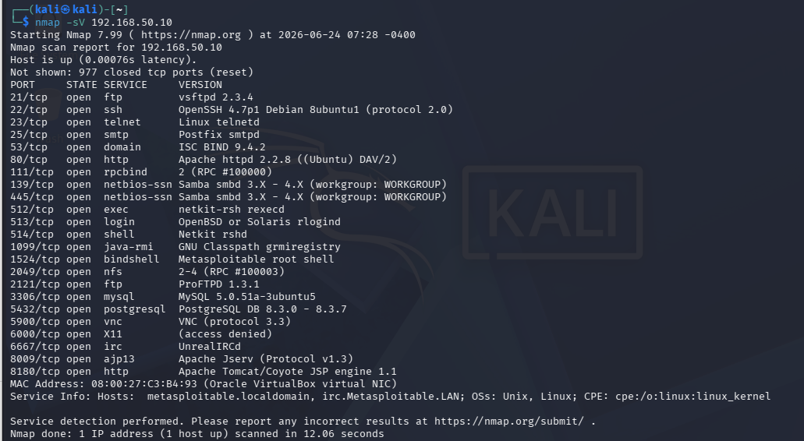
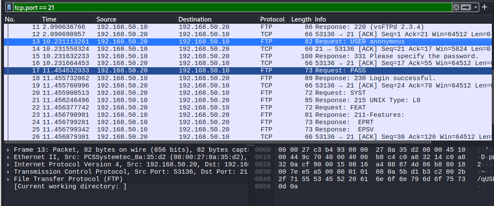
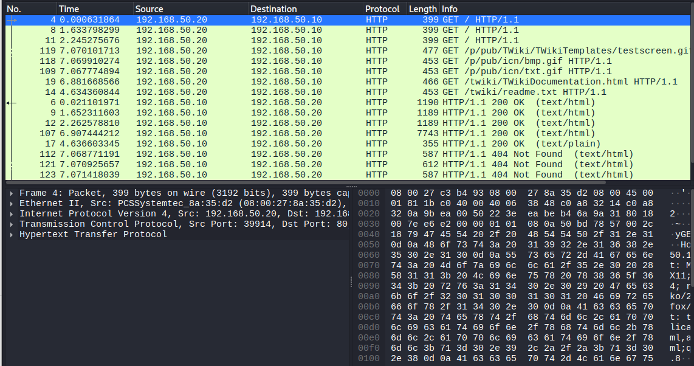
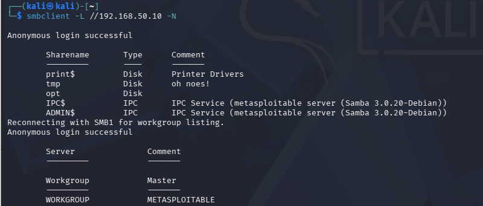
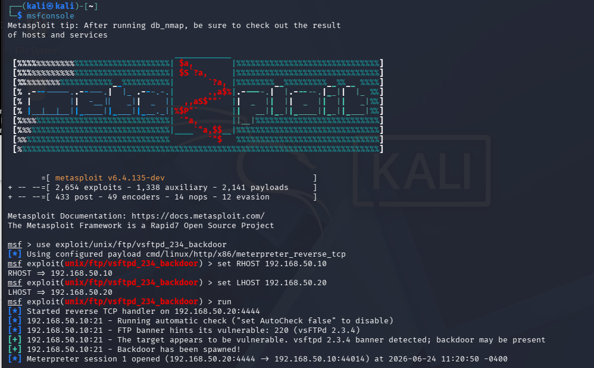

# Informe técnico - Homelab de Ciberseguridad

Este documento recoge el desarrollo técnico completo del laboratorio de ciberseguridad realizado en entorno VirtualBox con Kali Linux y Metasploitable 2.

El objetivo es documentar de forma detallada las fases de un proceso básico de pentesting en un entorno controlado.


## Máquinas Virtuales

### Kali Linux
IP: 192.168.50.20/24 (eth0)
Rol: atacante
Red: Internal Network (intnet)

### Metasploitable
IP: 192.168.50.10 (eth0)
Rol: víctima vulnerable
RED: Internal Network (intnet)

-------------------------------------------------------

## Red

Tipo: Internal Network (VirtualBox)
Nombre red: intnet

Objetivo:
- Comunicación entre Kali y Metasploitable
- Sin acceso a Internet

------------------------------------------------------

## Pruebas

### Ping Kali -> Metasploitable
Resultado = OK

Comando: ``` ping 192.168.50.10 ```

------------------------------------------------------

## Nmap scan - Metasploitable

### IP objetivo:
192.168.50.10

### Servicios críticos encontrados:


- 21 FTP (vsftpd 2.3.4)
- 23 Telnet (sin cifrado)
- 139/445 Samba
- 3306 MySQL
- 5900 VNC
- 6667 IRC
- 1524 bindshell (ROOT ACCESS)

### Conclusión:
Sistema extremadamente vulnerable, diseñado para laboratorio de ciberseguridad.

------------------------------------------------------

## Prueba FTP

### Objetivo:
Conectarse al servicio FTP en Metasploitable.

### Comando
```bash
ftp 192.168.50.10
```

### Resultado esperado:
Posible acceso como usuario anonymous (sin autenticación real).

### Observación:
FTP transmite credenciales en texto plano (sin cifrado).
Se finalizó con el comando ``` quit ```

------------------------------------------------------

## Captura FTP en Wireshark

### Problema:
No se observaron credenciales en la primera captura.

### Causa:
Wireshark se inició después de establecer la conexión FTP.

### Corrección:
Se reinició la captura antes de iniciar sesión FTP y se aplicó filtro tcp.port == 21.

### Resultado:
Se observan comandos USER y PASS en texto plano.



FTP transmite credenciales sin cifrar, lo cual permite interceptación en redes sin protección

------------------------------------------------------

## Captura HTTP

### URL:
http://192.168.50.10

### Observaciones:
El tráfico HTTP no está cifrado.



Se pueden ver una solicitud GET desde Kali para cargar la página, y si pinchamos en los diferentes recursos habrá más solicitudes GET a las que el servidor responde

### Riesgo:
Exposición de información en texto plano.

------------------------------------------------------

## Acceso SSH a Metasploitable desde Kali

### Objetivo
Obtener acceso remoto al sistema víctima a través del servicio SSH.

### Comando utilizado
```bash
ssh -o HostKeyAlgorithms=+ssh-rsa -o PubkeyAcceptedAlgorithms=+ssh-rsa msfadmin@192.168.50.10
```

### Resultado
Acceso exitoso al sistema Metasploitable como usuario `msfadmin`.

### Sistema objetivo
- Linux Ubuntu antiguo (kernel 2.6.x)
- Sistema diseñado para laboratorio de seguridad
- Servicio SSH expuesto con credenciales débiles

### Observaciones de seguridad
- Uso de algoritmos criptográficos obsoletos
- Acceso remoto basado en contraseña simple
- Entorno vulnerable intencionalmente

### Conclusión
Se logró pasar de reconocimiento de red (Nmap) a acceso interactivo al sistema remoto mediante SSH, completando la fase de acceso inicial en un entorno de laboratorio controlado.

## Comandos utilizados
- ```hostname``` -> metasploitable
- ```whoami``` -> msfadmin
- ```ip a``` -> IP accesible desde kali
- ```ls -la``` -> permisos
- ```uname -a ```-> ux metasploitable 2.6.24-16-server #1 SMP Thu Apr 10 13:58:00 UTC 2008 i686 GNU/Linux
- ```id``` -> uid=1000(msfadmin) gid=1000(msfadmin) groups=4(adm),20(dialout),24(cdrom),25(floppy),29(audio),30(dip),44(video),46(plugdev),107(fuse),111(lpadmin),112(admin),119(sambashare),1000(msfadmin)

--------------------------------------------------------

## Enumeración Samba

### Objetivo
Identificar recursos compartidos expuestos por el servicio Samba mediante SMB

## Servicio detectado
- Puerto 139/TCP
- Puerto 445/TCP

## Comando
```bash
smbclient -L //192.168.50.10 -N
```

## Resultado y Conclusión
Anonymous login successful

        Sharename       Type      Comment
        ---------       ----      -------
        print$          Disk      Printer Drivers
        tmp             Disk      oh noes!
        opt             Disk      
        IPC$            IPC       IPC Service (metasploitable server (Samba 3.0.20-Debian))
        ADMIN$          IPC       IPC Service (metasploitable server (Samba 3.0.20-Debian))
Reconnecting with SMB1 for workgroup listing.
Anonymous login successful

        Server               Comment
        ---------            -------

        Workgroup            Master
        ---------            -------
        WORKGROUP            METASPLOITABLE

- Conclusión: un usuario sin credenciales puede enumerar recursos compartidos, por tanto se identificó una configuración insegura de SMB que permitió el reconocimiento sin autenticación.
De hecho he probado conectarme a tmp como anónimo y el recurso me lo permitió, además con el comando "ls" se pudo observar los archivos sin ningún problema



Para el caso de conectarse a /opt con "smbclient //192.168.50.10/opt -N", la autenticación fue permitida pero el acceso a ciertos recursos compartidos fue restringido con:  tree connect failed: NT_STATUS_ACCESS_DENIED

--------------------------------------------------------

## Introducción a Metasploit

### Objetivo
Iniciar el framework Metasploit para explorar vulnerabilidades conocidas en el sistema Metasploitable

### Comando
msfconsole, desde Kali para abrir Metasploit
--------------------------------------------------------
## Búsqueda de vulnerabilidades en Metasploit

### Comando
```bash
search vsftpd
```

### Resultado
msf > search vsftpd

Matching Modules
================

   #  Name                                  Disclosure Date  Rank       Check  Description
   -  ----                                  ---------------  ----       -----  -----------
   0  auxiliary/dos/ftp/vsftpd_232          2011-02-03       normal     Yes    VSFTPD 2.3.2 Denial of Service
   1  exploit/unix/ftp/vsftpd_234_backdoor  2011-07-03       excellent  Yes    VSFTPD 2.3.4 Backdoor Command Execution


Interact with a module by name or index. For example info 1, use 1 or use exploit/unix/ftp/vsftpd_234_backdoor

## Selección de exploit

### Módulo seleccionado
exploit/unix/ftp/vsftpd_234_backdoor

Ese ya que coincide con la versión del servicio FTP detectado en Nmap (vsftpd 2.3.4)

### Tipo de vulnerabilidad
Backdoor que permite ejecución remota de comandos
--------------------------------------------------------

## Explotación FTP (vsftpd 2.3.4)

### Herramienta utilizada
Metasploit Framework

### Módulo usado
exploit/unix/ftp/vsftpd_234_backdoor

### Resultado
Se obtuvo una sesión remota activa (Meterpreter) en el sistema objetivo.

### Evidencia
```text
Backdoor has been spawned
Meterpreter session opened
getuid -> Server username: root
```



### Impacto
Acceso remoto al sistema víctima a través del servicio FTP vulnerable.

### Conclusión
Una mala configuración/vulnerabilidad en un servicio expuesto puede derivar en control remoto completo del sistema.
